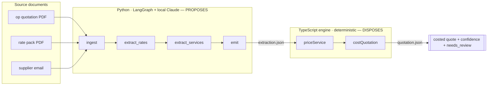

# Architecture — from this exercise to the product

The exercise is one quote against one rate pack. The product is many DMCs, thousands of
rates across hundreds of suppliers, and a document folder that never stops growing. This
sketches how the same boundary scales — no code here, just the shape.

## The pipeline, and where the boundary sits



Everything left of `extraction.json` is the LLM reading prose and proposing structure.
Every **number** is born to the right of it, in the engine. The seam is a file, so the
boundary is auditable, not just asserted. `ask/explain` reads back along the same line:
provenance travels with each figure, so "where did this number come from?" is answered
from data, never re-derived.

## Where this sits in the product

AterraAI's end-to-end flow is: inbound request → structured brief → itinerary →
**rate lookup → costing** → quotation → client proposal → booking handoff. This exercise
is the two bold steps — the first thing the product has to do well, and the one where a
confident wrong number does the most damage. The design below is how those two steps hold
up when the rate corpus and the tenant count grow.

## The invariant that does not change

**The LLM proposes structure; a deterministic engine owns every number.** That holds at any
scale. What changes is how rates are *stored* and *found*, not who is allowed to do the maths.

## Data model (multi-tenant)

Aterra is multi-tenant; a DMC's data must never touch another's. Every table carries
`tenant_id` and is protected by Postgres row-level security.

```
supplier(id, tenant_id, name, contact)
rate(id, tenant_id, supplier_id, service_name, basis, value, currency,
     kind,                       -- pack | correspondence | carried_forward
     validity_from, validity_to,
     season_from, season_to,     -- null unless seasonal
     source_document, source_locator, raw_value,   -- provenance travels with the rate
     superseded_by,              -- self-reference; correspondence supersedes pack
     embedding vector(1536))     -- pgvector, for retrieval
service_line(id, tenant_id, quote_id, description, basis, quantities jsonb,
             date_in, date_out, rate_id, confidence_tier, needs_review_reason)
quote(id, tenant_id, ref, pax, resolved_subtotal, stale_indicative, status)
```

Provenance is a first-class column set, not a log line — that is what lets the agent answer
"where did this number come from?" and, later, deep-link the user to the source in an
in-platform inbox (the `ref` field the extraction already emits).

## Rate matching at scale = retrieval, not a flat scan

In the exercise the model sees all ~35 rates at once, so matching is a prompt. With thousands
of rates that breaks. The scale answer:

1. **Embed** each rate row (service name + basis + supplier) into pgvector on ingest.
2. For each booked service, **ANN search** the tenant's rates for the top-k candidates.
3. **Deterministic re-rank**: filter by basis compatibility, validity window and season, then
   let the LLM choose among the survivors — a small, bounded decision, never a free-text guess.
4. The engine costs exactly as it does today. Retrieval changes recall, not arithmetic.

This keeps the token cost flat as the corpus grows and keeps the model's job narrow.

## The action loop (supplement, wired)

`needs_review` is not a dead end. `draft_supplier_request(supplier, service, field)` turns an
item into an outbound query; the reply is parsed as a `correspondence` rate (the Camissa path),
a human confirms, and the new rate supersedes the old. Because rates are shared records, one
update fans out to every quote that referenced it — scoped and previewed before it touches a
sent proposal.

## Observability

LangGraph nodes are trace points; LangSmith (behind an env flag) captures each extraction and
match for replay and regression. The eval set (`eval/`) is the seed of a living golden set that
grows every time a human overrides the model.
